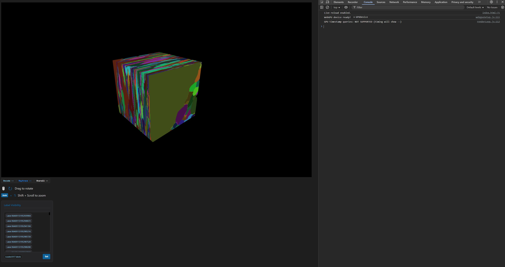
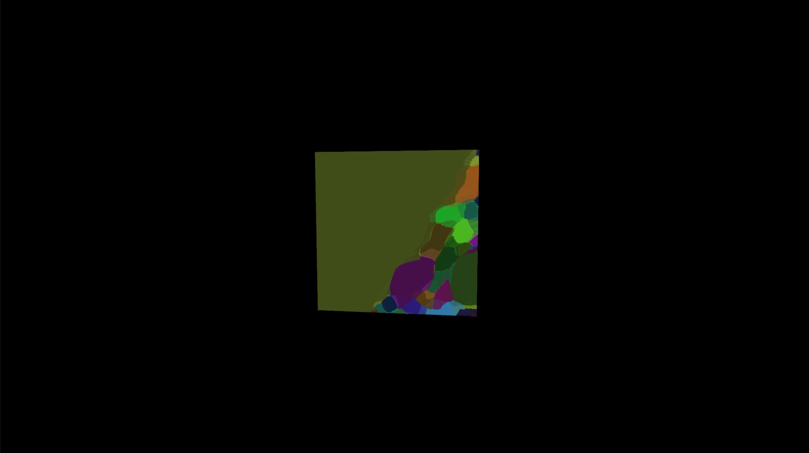

# Fast Compressed Segmentation Volumes for Scientific Visualization - Implementation in code

## Introduction

This is an attempt of a faithful implementation of the 2023 publication "Fast Compressed Segmentation Volumes for Scientific Visualization" by
Max Piochowiak and Carsten Dachsbacher. The paper focuses on efficient compression and decompression of large voxel datasets for rendering attempting to combine high comrpession rates with satisfactory performance relying on segmenting the volume into smaller "chunks" (bricks) to leverage the parallel computing capabilities of GPU hardware. To show the correctness of the data encoder/decoder a simple ray marcher is implemented for that purpose. A brief overview:

* The **Encoder** runs in *C++* and generates a custom file where the compressed data are stored. The comrpession ration achieved is $ < 5$% typically.
* The **Decoder** and the **Renderer** run on a chromium browser using *WebGPU* using compute shaders for both parts.

The paper's descriptions of the algorithm is used as reference for structuring and implementing everything in code. It must be highlighted that no code provided by the authors was found online to consult and inspect more closely.

## Installation

* Download the repo or clone it
* The repo includes already a compressed dataset at dimensions $512\times 512 \times 512$ as set in `dataset_downloader.py` (didn't go higher due to hardware limitations)
* It is not necessary to build the **C++ Encoder** but should yo wish to, you can run `GenerateProjects.bat` (double-click) and it will generate the necessary project files to open the solution in the IDE of your choice. The project was built using Visual Studio 2022 (v142) so this might need manual tweaking in the project's properties if you use a different version of Visual Studio.
* To run the renderer you need to **run it via a local live server**. Opening the HTML file directly (e.g. via `file://`) will cause it to crash due to browser security restrictions.

### Using VS Code Live Server (What I used)

1. Open the project folder in **Visual Studio Code**
2. Install the **Live Server** extension (by Ritwick Dey)
3. Right-click the main HTML file
4. Select **"Open with Live Server"**
5. The app will open in your browser and run correctly

## Documentation

This repo includes a Doxygen configuration to generate API documentation for the *C++* encoder, *JavaScript*-*WebGPU* code, and *WGSL* shaders. The documentation `html` file is located in [docs/index.md](docs/index.md). Open it in a browser using a live server (instructions right above) to see a more thorough explanation of the classes and functions used for the project.

## Results and Visual Examples

### Single View

*Figure 1: Ray-marched visualization of the compressed segmentation volume using the WebGPU renderer. The program was tested on a 512x512x512 volume with bricks of 64x64x64 dimensions (512 bricks total)*

---

### Comparison Views

  
  

  <em>
    The same visualization from varying distances. Small visual differences can be observed indicating the LOD algorithm taking effect.
  </em>

## References

* [Piochowiak, Max, and Carsten Dachsbacher. "Fast compressed segmentation volumes for scientific visualization." IEEE Transactions on Visualization and Computer Graphics 30.1 (2023): 12-22.](https://scispace.com/pdf/fast-compressed-segmentation-volumes-for-scientific-34j2tgnl4e.pdf)

* [WebGPU](https://developer.mozilla.org/en-US/docs/Web/API/WebGPU_API)
